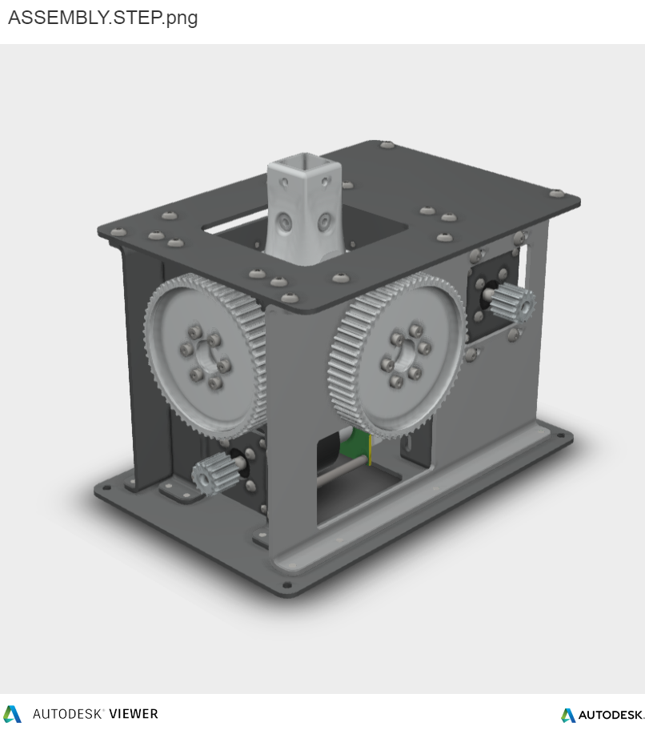

# bldc-ffb-joystick-base
This project contains CAD files needed to perform mechanical assembly of a base for FFB joystick.

 

3d-print-parts - all elements which need to be printed  
sheet-metal-parts - drawings for case parts, including holes and bending profiles  
assembly - full STP assembly, preview it online at https://autode.sk/3tObyss  
  
  
| Parts                         |    |
| ----------------------------- | -- |
| PANEL\_BACK\_FRONT            | 2  |
| PANEL\_RIGHT                  | 1  |
| PANEL\_TOP                    | 1  |
| PANEL\_BOTTOM                 | 1  |
| PANEL\_LEFT                   | 1  |
| PANEL-MOTOR                   | 2  |
| GIMBAL\_ARM\_FRAME            | 2  |
| PULLEY                        | 2  |
| GIMBAL\_ARM\_BEARING\_PILLOW  | 4  |
| GIMBAL\_CORE\_JOINT           | 1  |
| GIMBAL\_STICK\_CONNECTOR      | 1  |
| GIMBAL\_MAIN\_BEARING\_PILLOW | 4  |
| MOTOR\_MAGNET\_MOUNT          | 2  |
| STANDOFF\_80MM                | 8  |

| Nuts                          |    |
| ----------------------------- | -- |
| M4                            | 12 |
| M5                            | 1  |

| Bolts                         |    |
| ----------------------------- | -- |
| M5 x 10                       | 8  |
| M4 x 30                       | 12 |
| M4 x 8                        | 8  |
| M4 x 10                       | 8  |
| M3 x 6                        | 16 |
| M4 x 12                       | 24 |
| M5 x 6                        | 40 |
| M5 x 20                       | 1  |

| Bearings                      |    |
| ----------------------------- | -- |
| 6802                          | 8  |
| 6808                          | 4  |
| F625                          | 2  |

| Motor                         |    |
| ----------------------------- | -- |
| APS5063 - 60kV                | 2  |